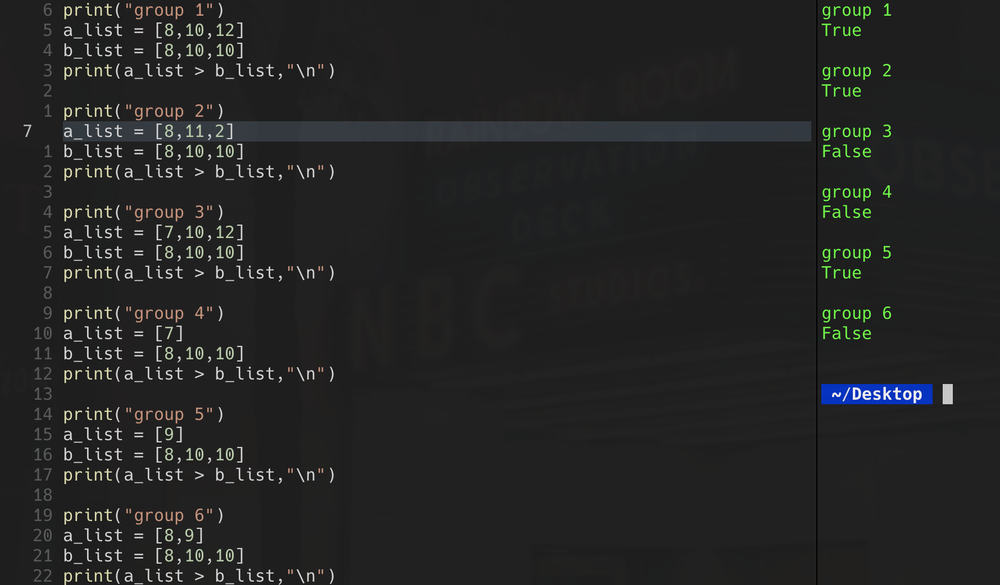

### 18 - 6 - 2020 題目

> 下面这段代码打印出来的结果是什么？
>
> a_list = [9,1,2]
>
> b_list = [7,9,10]
>
> print(a_list > b_list)
>
> 
>
> A: True
>
> B: False
>
> C: true
>
> D: false

答案： **A: True**

因为 a_list 里的头一个数字比 b_list 里的头一个数字大。

逐一比较，当相同位置的数目相同时，才会跳到下一个数目作比较

