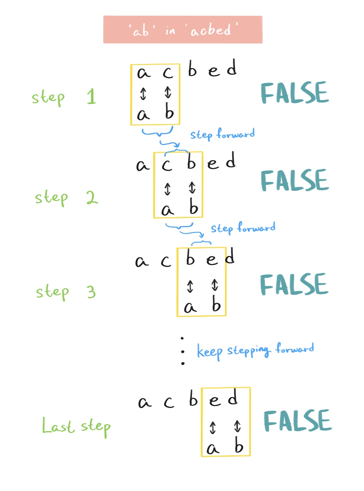

### 28 - 6 - 2020

> 表达式 'ab' in 'acbed' 的值是什么？
>
> A: 02
>
> B: True
>
> C: 'ab'
>
> D: False

答案: **D. False**

## 解析過程

‘in’ 适用于列表、元组、字串等，会于当中依序搜寻提供的搜索数值，而这题属于字串搜寻。

题目为 ’ab’ in ‘acbed’

其运作方式可以先由折分组别开始理解。

设 in 的左边为 A 组，in 的右边为 B 组。

A 组为搜索数值，而 B组则为被搜索的字串。

然后看 A 组，A 组里有 2 个字符长度。

然后看 B 组，把 A 组里的 2 个字符长度并列在 B组的开头，然后开始核对，看看 A 组的两个字符能否对上 B 组的开头两个字符，如果能即返回 True。如果不能，会在 B 组向前进一个字符，此时即 B 组的第二字符，以 B 组第二个字符开始与 A 组字串对比。

这样的核对流程会于以下两个情况结束，一是在 B 组里找到 A 组的字串，并返回 True；二是 A 组最后一个字符碰上 B 组的最后一个字符，此时如果刚好在 B 组里找到 A 组字串，就会返回 True，如果不能，则返回 False。

以下是图表解释，以助更好的理解。

