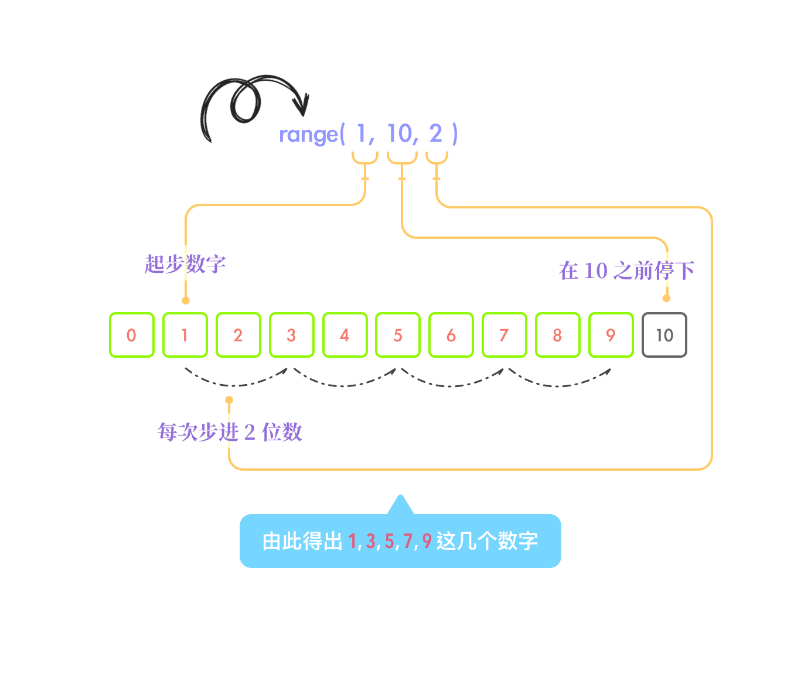

### 30 - 6 - 2020 題目

> 表达式 sum ( range(1, 10, 2) ) 的值是什么？
>
> A: 25
>
> B: 11
>
> C: 13
>
> D: 35

答案： **A. 25**

## 解析思路

这里包含了两个函数，分别是 sum() 和 range()。而 range() 是个特别的函数，因为它是一个構造器，用作生成等差數列。

这题目的解题步骤应该从内部开始看起，即 range(1, 10, 2) 部份。

如果我们只是单单表面看，一定是不容易看出端儿的。于是我们还是一样找到官方文档查看每个对应位置都代表了什么意思，以下为官方资料：

> *class* `range`(*stop*)
>
> *class* `range`(*start*, *stop*[, *step*])
>
> The arguments to the range constructor must be integers (either built-in `int` or any object that implements the `__index__` special method). If the *step* argument is omitted, it defaults to `1`. If the *start* argument is omitted, it defaults to `0`. If *step* is zero, `ValueError` is raised.
>
> For a positive *step*, the contents of a range `r` are determined by the formula `r[i] = start + step*i`where `i >= 0` and `r[i] < stop`.
>
> For a negative *step*, the contents of the range are still determined by the formula `r[i] = start +step*i`, but the constraints are `i >= 0` and `r[i] > stop`.

相信你曾经可能会用过 range(x) 这样的用法，但其实他还有加长版的。而这加长版就与其他程序语言非常相像了，例如 javascript 里的 for (var i = 0; i < a; i++)，但这里就不赘述 python 以外的知识点了。

在第二段里他用公式来说明了，即 r[i] = start + step*i where i>=0 and r[i] < stop。但我相信这说法会让人不容易懂其在说什么。

于是你可以看我以下大白话版的说明，

range( 从第几位数开始算起,   总共有多少个数字，并在这个数字之前就要停止,   下一个数字和上一个数字相隔多少 )

我们再以题目为例用以下图示说明。

以上可以看见是如何运作的，之后就得出以下几毎数字。

1, 3, 5, 7, 9

而这些数字是以列表形式呈现，即 [1, 3, 5, 7, 9]。

好了，再接着看 sum() 函数。这个比较容易理解，从字面了解，就是把列表里的各个数字相加。这里提一下，sum() 函数不单单可以把列表相加，还可以将元组、集合相加等。如果根据官方文档说明，其实只要是 iterable 性质的值都能相加，而这里也不对 iterable 加以赘述了。

因此最后答案即是

1 + 3 + 5 + 7 + 9 = 25