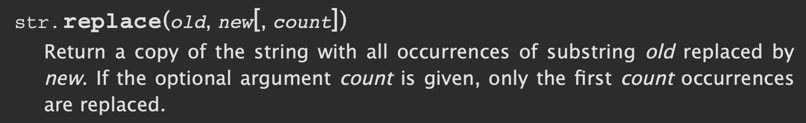

### 1 - 7 - 2020 題目

> 表达式 'abcab’.replace ('a’, 'yy') 的值是什么？
>
> A: 'yybcyyb'
>
> B: 'abcab'
>
> C: 'abcabyy'
>
> D: 'yyabcab'

答案： **A: 'yybcyyb’**

## 解析思路

这题目其实不怎么难，难就难在怎么看官方文档上。

首先，解题方向落在了 replace() 身上，大家可以单从字面意思猜出大概是替换一些东西的意思，但细节该怎么替换就不知道了。

于是我们上官方文档查一下，怎料一查，弹出了很多个有关 replace 的结果。例如

bytearray.replace()
dataclasses.replace()
replace()
… … 

究竟看哪个才对？我们看回题目，细心地看，能看到 replace 之前还有一个点，这个点之前还有一段字串(string)，那就代表这个 replace 是一个方法(method)，而不是一个函数(function)。

还有，replace 之前接的是字串 (string)，于是乎我们找的方向应该是 string.replace()，或者是 str.replace()。

真好，一查之下，正好是 str.replace()。以下就是官方的说明，我在这把整段文字复制过来吧。

str.replace(old, new[, count])
Return a copy of the string with all occurrences of substring old replaced by new. If the optional argument count is given, only the first count occurrences are replaced.

嗯... 怎么看也有问题。跟着意思做，套入一些随意的数字看看，例如 'abcab'.replace('a',’yy’,2)。

可是出来的结果却不是文字表达的意思。文字里说的 only the first count occurrences are replaced，不就是说只代替第一个搜寻结果吗？怎么全部都给替代了呢？难到官方文档出错了？

但......你细心看看它写的是 "occurrences are”，是英文众数表达形式。可前面却写 “only the first count”，是英文单数表达形式。不对呀，学校不这么教的呀﹗怎么官方文档连这么浅显的英文文法也会写错呢？

原来呀，看官方文档不能只看文字，也要看格式的，由于微信不能把格式也复制过来，于是我就发它的撷图版过来吧。

你看，有的字是瘦的，有的是斜的，有的是用方括号括着的，他们都表示着不同的意思呢。

你再看看这句 “only the first count occurrences are replaced”，里边的 count 是斜的，意思就是说 count 不是句子里的一个字，而是要被替换掉的一个字。

count 在 Python 里代表任意的数字。所以我们把句子里的 count 随意代替一个数字再试试理解看，“only the first 2 occurences are replaced”。你看，意思就通了，替换掉头两个数字。所以呢，看文档必须小心看好格式的问题。

再说明白点，大概意思就是替换掉多少个首先搜到的结果，而如果不写这个参数(即第 3 个参数)，就会把全部搜到的结果都替换掉。

所以呢，看文档时必须小心看好格式的问题。

好了，count 这部份搞明白了。我们再看 old 和 new。他们也是可以被替换的词。old 是旧，new 是新，这容易理解，就是把旧的替换成新的。

所以，我们看回题目。

'abcab'.replace('a','yy')

一下子好理解吧，就是把所有 “a” 替换成 “yy”。

所以答案就是 A: 'yybcyyb’