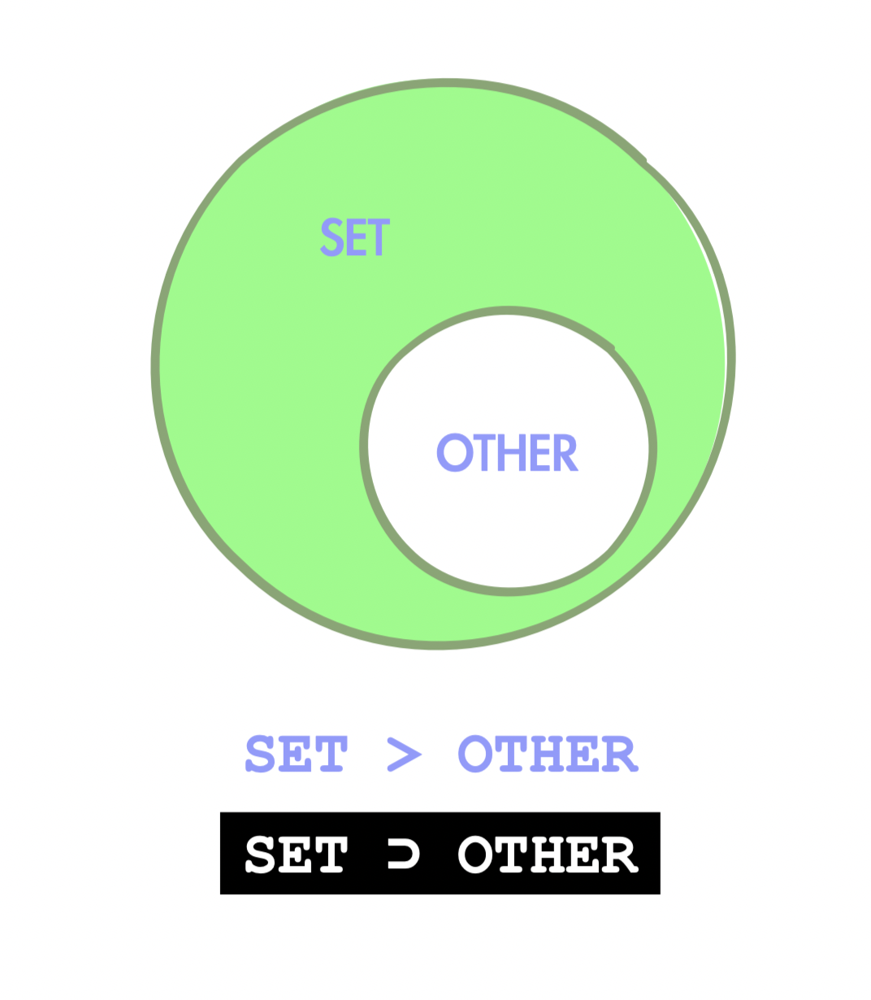

### 2 - 7 - 2020 題目

> 表达式 {1, 3, 2} > {1, 2, 3} 的值为True。这种说法正确吗？
>
> A: 正确
>
> B: 错误

答案： **B: 错误**

## 解析过程

在开始之前，我想提一下之前其中两条出過的题目，而这两题都跟这题目有点关系。

其中一条类似是 (1, 2, 3) <  (1, 3, 2)。

就是对齐相同位置的数字不断比较大小，相同大小的就跳下一个，遇到哪个大的或者比到最后了才停下判断结果是 True 还是 False。

再者，还有一题关于 + 号能否用于集合(set) 相加合并的问题，答案大家也知道是不能的，而是只能用 | 号去实现。

之所以帮大家回顾这两道题，是想让大家知道，元组(tuple) 里的数字是可以比大小的，并且列表(list)、元组(tuple)之类的也可以用 + 号相加合并。但偏偏来到集合就不行了，从而可以猜到集合的运算并不简单，是有点异类的感觉。

于是我们还是查查官网的文档了。

{ } 号大家也知道它就叫集合(set)，所以我们自然而然地就去文档里找 set 的资料。

当查到了 set 的资料，你会发现它底下的资料特别多，于是我们就要透过速读法快速找出关键的资料，以下是我找到的关键资料撷取。

> set > other
>
> Test whether the set is a proper superset of *other*, that is, `set >= other and set != other`.

原来 set 的 > 号不是用来比大小的，而是逻辑学里的父集 ⊃ (superset)。

说得明白点即判断另一个东西有没有包含在我这里面，用图表示就是以下这样。

当我们有了基础知识了，就可以看回题目了。

{1, 3, 2} > {1, 2, 3}

\> 号的左边代表以上的 set，右边的代表以上的 other，那右边里的全部单项都有包含在 set 里边吗？并且 set 还有 other 没有的单项吗？

答案是有和否，再根据布尔运算(Boolean)。

True & False --> False

那最后答案自不然就是 False 了。
