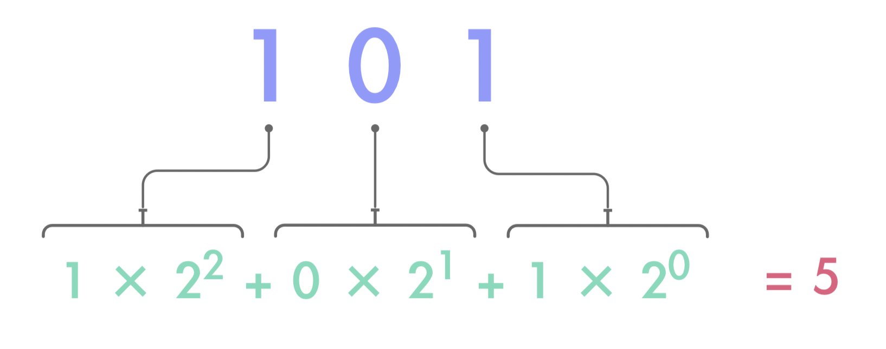

### 8 - 7 - 2020 題目

> 表达式 int ('101',2) 的值是什么？
>
> A. 101
>
> B. 119
>
> C. 5
>
> D. 程序报错

答案： **C. 5**

## 解析过程

根据 Python 官方文档 int ( ) 一节。int 函数的作用便是将一个特定进制的数值转化为 10 进制数值。

int ( ) 可以有两种用法，分别为：

> *class* `int`([*x*])
>
> *class* `int`(*x*, *base=10*)

而对应题目的，就是以上的第二种用法。

x 为数字值， base 为各种进制值。

在我们的生活里最常见的当然是 10 进制或16 进制 (例如. 16 两 = 1 斤)。

但在电脑世界里，其实还有另外常见的 2 进制和 8 进制。

上面的 x 值会因为进制值的不同，而需要有对应的写法。

意思就是当为 2 进制时，x 值只能包含 1 和 0 (例如 101010)。

而当为 16 进制时，x 值只能包含 0-9 及 a-e (顺序分别代表 10-15)。

另外，你们小心注意看看题目里的 101 值，是用 ‘ 号包围起来的，而不是裸裸地只写个数字便可以，因为这是官方要求的。

但如果你再细问，为啥官方一定要把数字用 ‘ 号包围起来？是因为当超过 10 进制时，x 值就只能用 a-z 表示，字母可是字符串来的 (string)，而字符串是一定要被 ‘ 或 “ 号包围起来的，所以大家在使手 int () 函数时就要小心了。

好了，解释差不多了，剩下的一切都很简单。

题目所示，101 值为一个 2 进制，我们试着用中学所教的数学计算，将 2 进制转化为 10 进制吧（注釋 1）。

所以答案便是 5。

---

注釋 1：如何理解為甚麼 2 進制是用這樣的次方方程計算的？你可以看[這篇](./200708_formulaForBinary.md)文章。