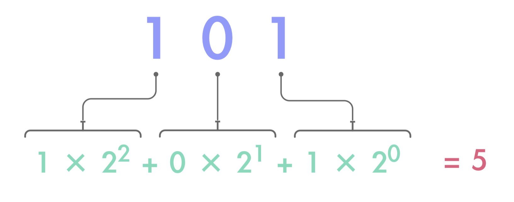
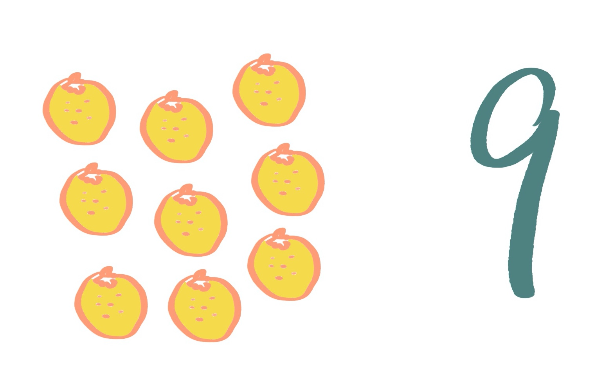
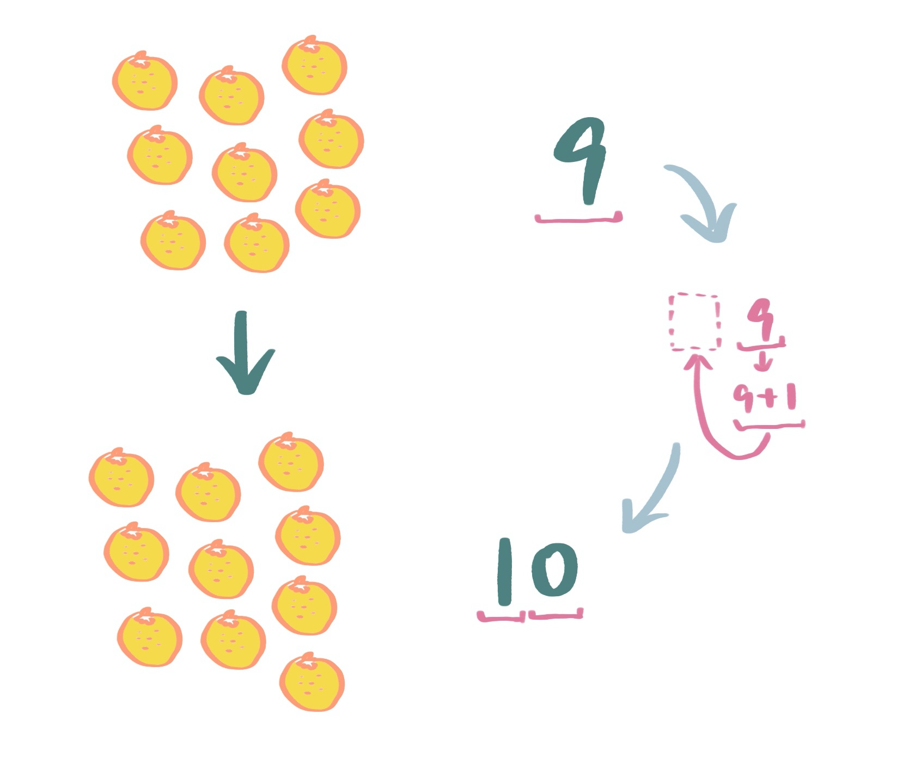
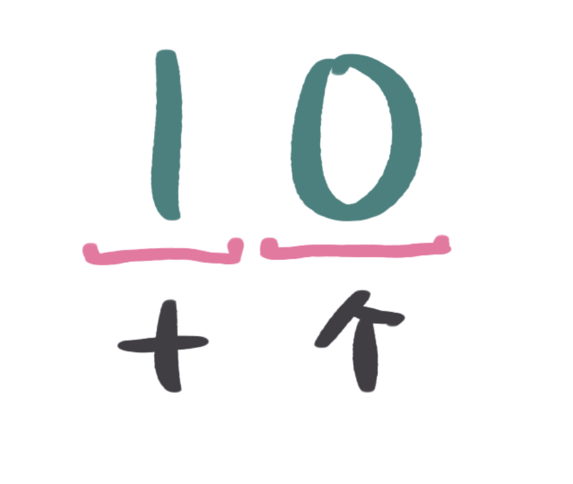
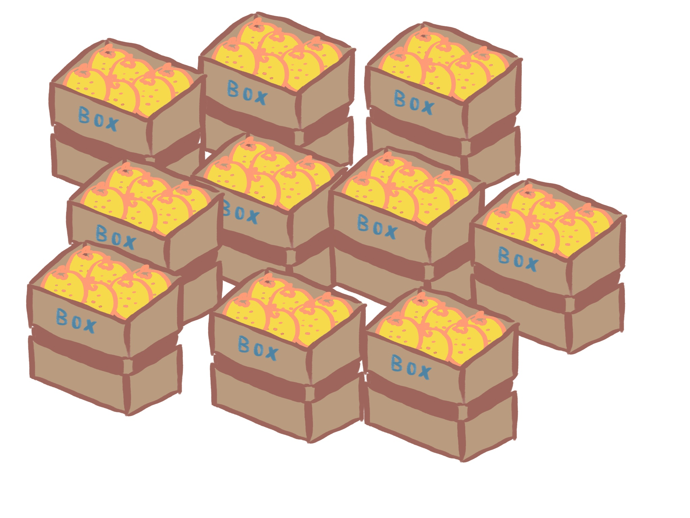
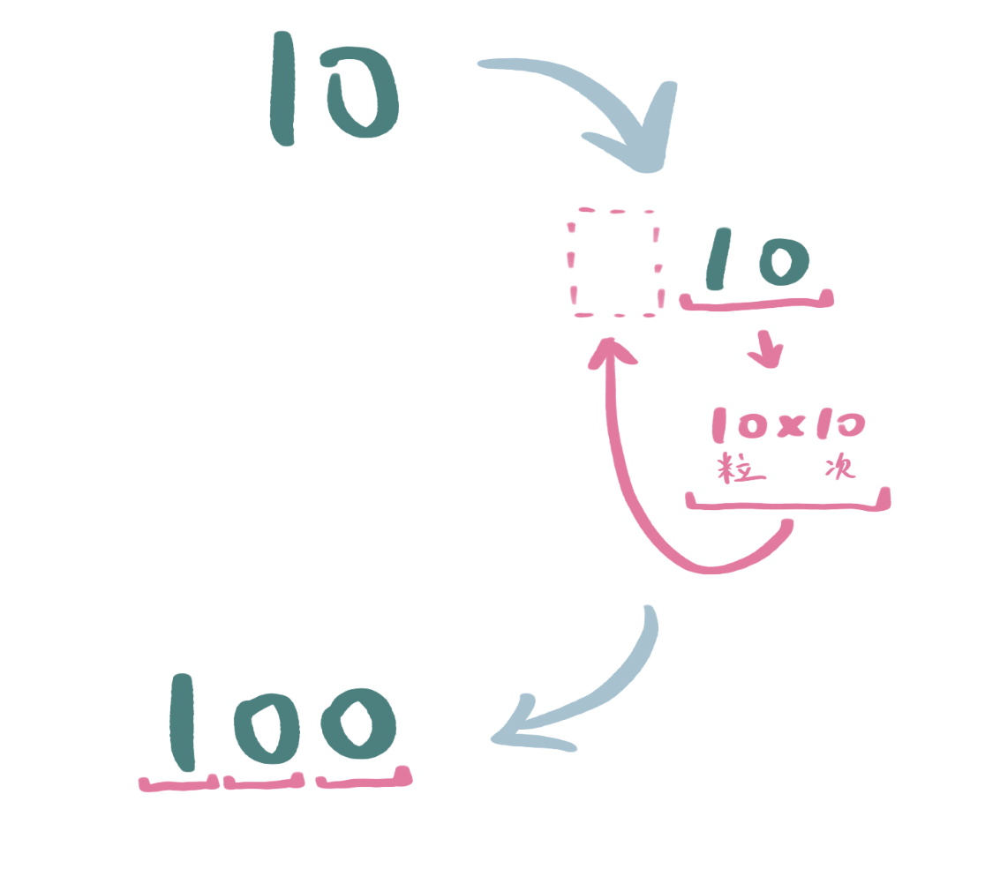
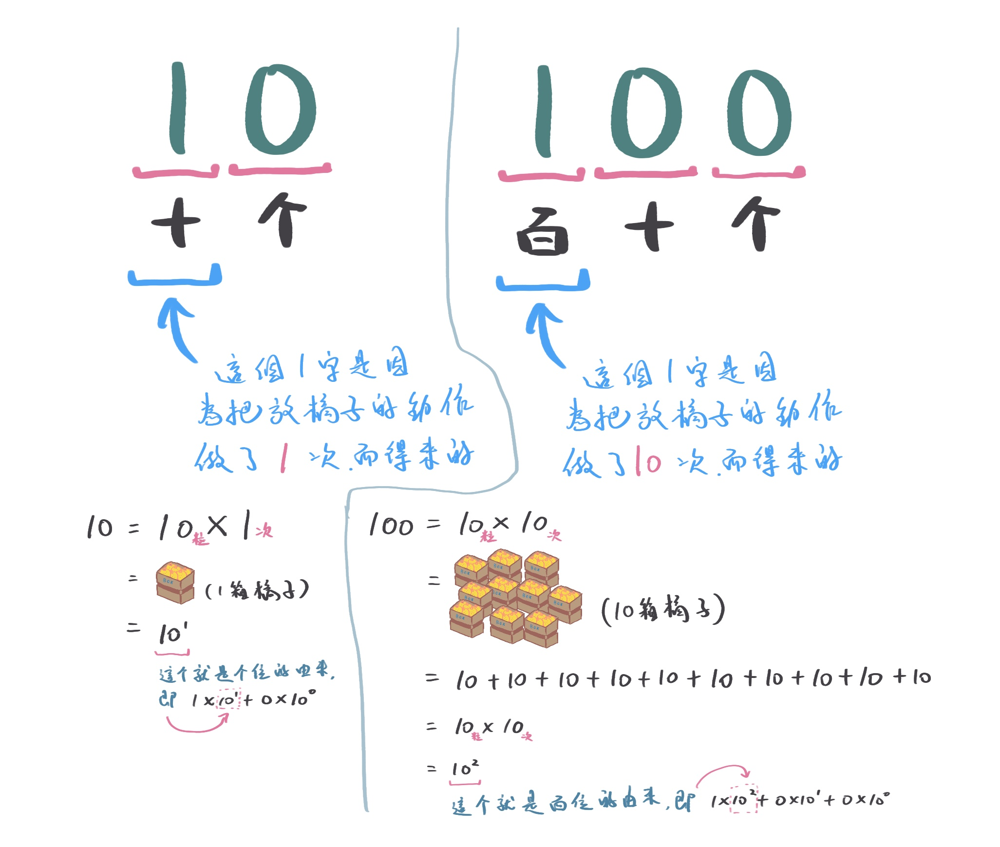
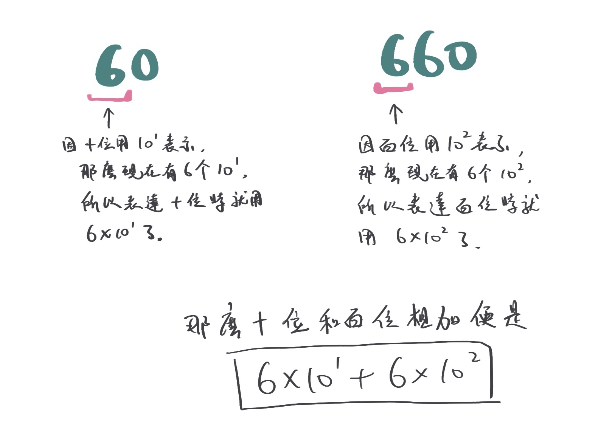
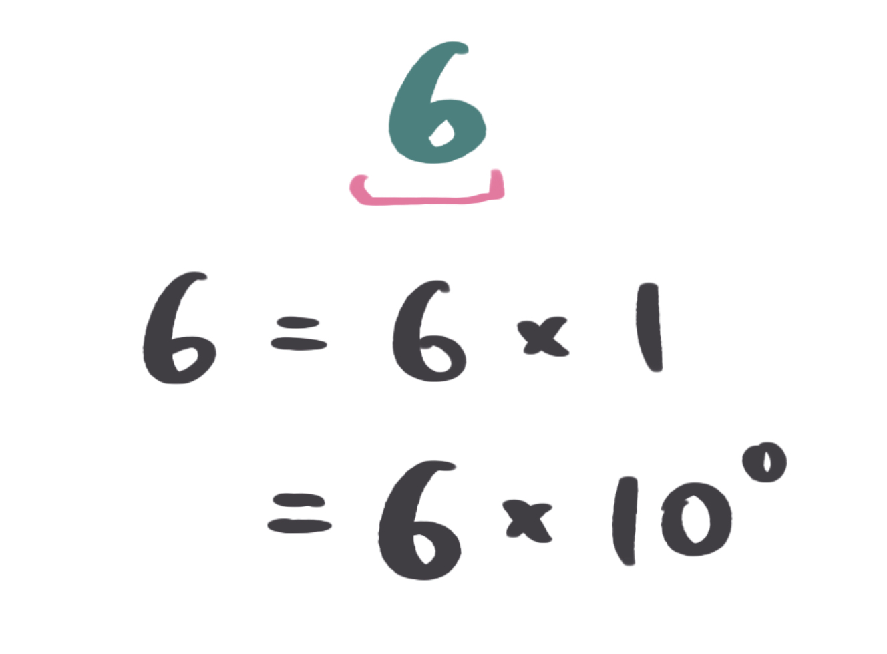
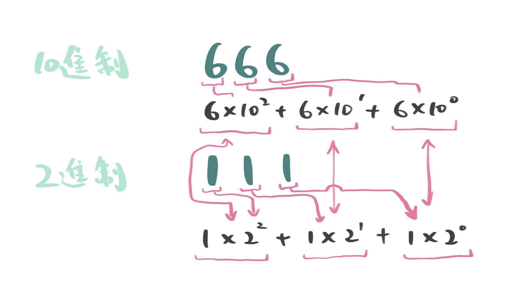

要理解為甚麼 2 進制是用這樣的次方算的，我們該由這世界的誕生開始說起，你要知道這世界本來無一物，世間萬物始於我們人類賦予的意義。

例如，人生有何意義？如果你不賦予給你自己，你何來有意義？

人權、言論自由，國家法律不賦予，國家人民何來有？

紙幣，如果國家不賦予給它一個價值，那它只是一張廢紙，那你為甚麼還要有它？

你的名字，你父母不給你改，你何來有名字？

所以數學，也是因為人類幫它做各種定義，它才立存至今。

你要知道數字 1 - 9 或者說其他的例如 648、29384、123、666、999，本來世界都沒有的，你現在所用的 10 進制只是一套人類賦予的符號標法，當這套符號標法還沒存在世時。你就只知道、也只能看見物體數量本來的真實面目。例如下圖所示：

或者下圖:

你如果仔細數，你知道上邊有 6 隻羊和 78 個演奏家。

但你能寫出 6 和 78 這兩個數字，是因為你用了古人智慧留下的計數法。

不然，你就真的只能用肉眼看到 6 和 78 了。

但用肉眼看數目，這真不是好辦法呀，如果是 4352 隻羊呢？怎麼看？

所以，古人開始研究計數法了，在開始之初，他們的計數法是像下圖這樣的。

就是用手指﹗

你有幾隻？不夠用嗎？那用上你的腳指吧。還不夠用？用上你媽媽、弟弟、奶奶的吧。還不夠用？

對的，真不夠用，所以又再演變至以下這樣：

這樣的計數法已經好很多了。

可是...

你想起以前的一個故事了嗎？一個小孩學寫數字，你告訴他一字的寫法為「一」，二字的寫法為「二」、三字的寫法為「三」，然後那孩就舉一反三了。將 4 至 10 的寫法寫成以下那樣。

哈哈，有問題吧？

所以到了最後的最後，你就見到了你現在所用的 10 進制計數系統了。

那麼，我們就從這 10 進制開始了解你的問題了。

以下是一個箱子和 9 粒橘子。

9 粒橘子用以下數字代表。

當你再多一粒橘子時，你的數目就會從 9 變成 10，而 9 變成 10 時的演變過程是這樣子的。

上圖的意思就是說當你每有 10 粒橘子時，10 進制的計數法便是「10」這個寫法。

好了，那我們就把每 10 粒橘子放進箱子，那麼一箱便是 10 粒。

現在，我們看到仔細研究這個 10 數字。

如果你的數量還不在超過 10 個時，你就只需要用到個位數。但只要你一超過 9 個，剛好來到 10 個時，你便需要用到十位數了。

那麼如果我們把上面的放橘子步驟重複做 10 遍。

那麼你就會由原來的 10 粒變成 100 粒了，而 10 變成 100 時的演變過程是這樣的。

如果你仔細想想，你會發現 10 和 100 的十位和百位都可以用同一樣的數學公式去表達。

從上圖可見 10 字頭上的次方，便是自乘了多少次的意思。

所以 1000 便是 10 x 10 x 10，也就是 10 的 3 次方，即 10^3。

那麼，如果要表達 60 或 660 呢？那麼就可以用以下數學公式表示。

那麼要怎麼表達個位的數呢？

10 的 0 次方不就等於 1 嗎？所以個位數就簡單地用 1x10^0 就可以表達了。如下圖的 6 的表達方法。

 

所以 666 的數學表達式便是 6 x 10^2 + 6 x 10^1 + 6 x 10^0 。

好了，回到你的問題，其實 2 進制和 10 進制的概念一樣，只是逢 2 進 1 而已。所以你只要把 10 進制的 10 粒橘子一箱，改成 2 粒橘子一箱，再由上面開頭走到尾一次，你便理解你所問的問題了。

