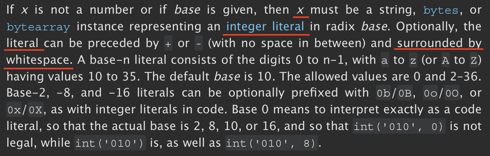
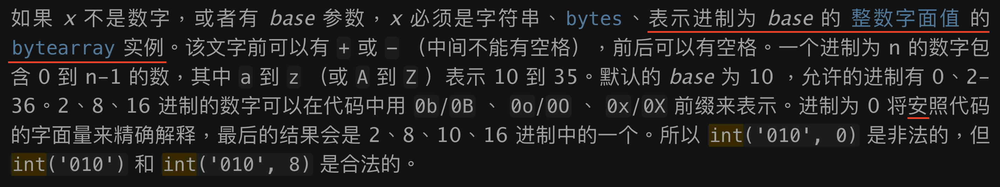

# 對於 Python 的英文和中文官方文檔的看法

抱歉，這次的解析來遲了。因為 int() 這函數看似簡單，但在一查官方文檔之下，才知道它還隱含了巨多細節。很多細節和專業名詞都不明白，於是乎逐個查，再接著又發現單個專業名詞又含有很多細節。

再者，我很大機率覺得英文版的官方文檔寫得還是有點含糊，使人很容易看不清楚，容易理錯意，我舉些例子。

上圖第 3 行第 1 個劃線，這個 literal 指的並不是第 2 行的 integer literal，而是第一行的 x，它這樣寫實在太容易讓人想到別處了。

上圖第 3 行第 2 個劃線，它應該要寫得再好一點，該在 surrounded by 前加上 can be，不然我們就會有可能理解它為當在 x 前加上 + 或 - 號時，也必須用空格將 x 包圍起來。

上圖第 3 行的 can be preceded by + or -，這句也容易讓人誤解，因為 x 值的寫法可以為 ‘100’，如果按照這裏官方文檔的意思，就可以寫成 -‘100’，可是這樣寫可是錯誤的，正確寫法應該是 ‘-100’。

另外，我隨便也查了查中版的 python 官方文檔，似乎也有另外的錯。我舉些例子。

上圖第 1 行寫的「表示进制为 *base* 的 [整数字面值](https://docs.python.org/zh-tw/3/reference/lexical_analysis.html#integers) 的 [`bytearray`](https://docs.python.org/zh-tw/3/library/stdtypes.html#bytearray) 实例」，如果按照英文官方文檔的意思，應該不太像這樣翻譯。

整句應翻譯為「如果 *x* 不是数字，或者有 *base* 参数，*x* 必须是表示进制为 *base* 的 [整数字面值](https://docs.python.org/zh-tw/3/reference/lexical_analysis.html#integers) 的字符串、[`bytes`](https://docs.python.org/zh-tw/3/library/stdtypes.html#bytes)、 [`bytearray`](https://docs.python.org/zh-tw/3/library/stdtypes.html#bytearray) 的实例。」

另外，倒數第 3 行，也出現了一個錯別字「安」，正確寫法應為「按」。