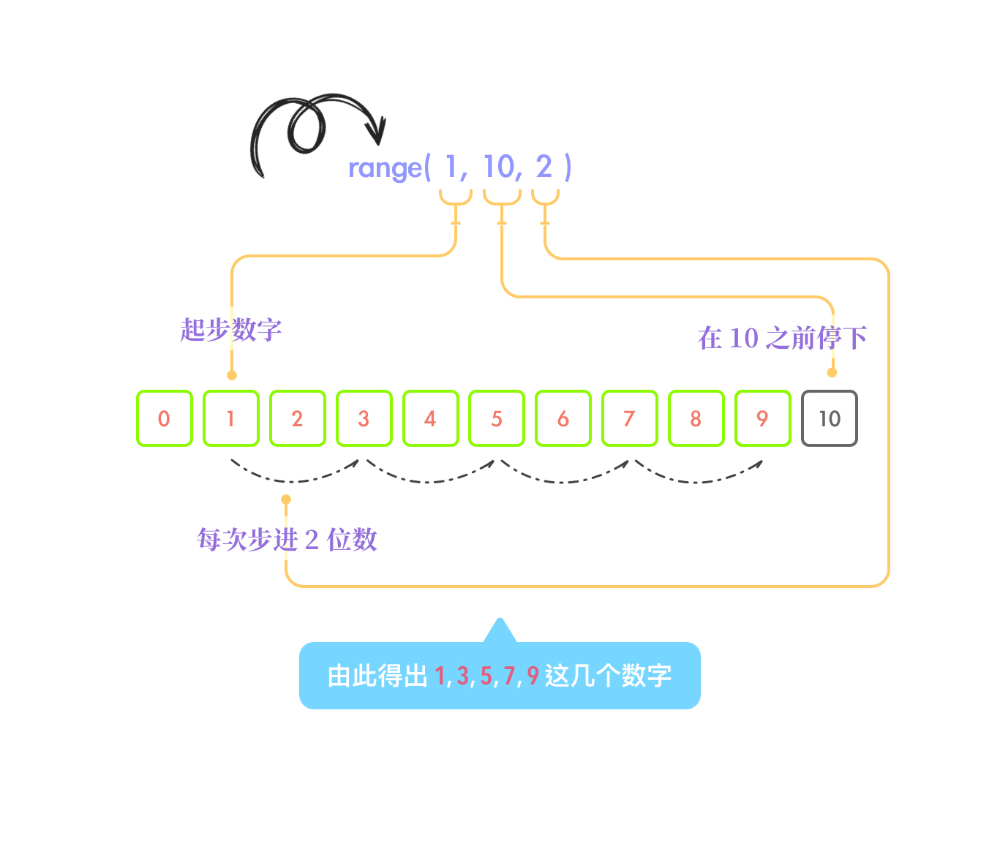
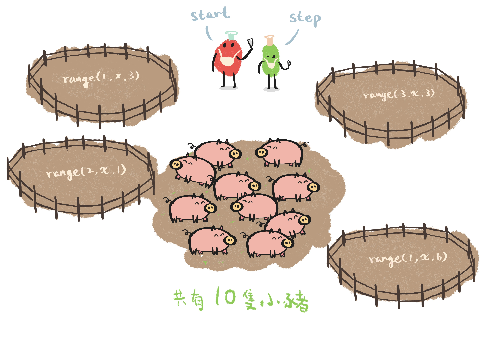

### 10 - 7 - 2020 題目

>表达式 sum(range(1, 10, 2)) 的值是什么？
>
>A. 25
>
>B. 11
>
>C. 13

答案： **A. 25**

## 解析过程

这题包含了两个函数，分别是 `sum()` 和 `range()`。

而 `range()` 是个特别的函数，因为它是一个生成器，用作生成*列表 (list)*。

这题目的解题步骤应从内部开始看起，即 `range(1, 10, 2)` 部份。

为了了解每个参数各自的作用，我们需要参考一下官方文档。以下为 `range()` 函数说明文字的撷取：

> *class* `range`(*stop*)
>
> *class* `range`(*start*, *stop*[, *step*])
>
> The arguments to the range constructor must be integers (either built-in `int` or any object that implements the `__index__` special method). If the *step* argument is omitted, it defaults to `1`. If the *start* argument is omitted, it defaults to `0`. If *step* is zero, `ValueError` is raised.
>
> For a positive *step*, the contents of a range `r` are determined by the formula `r[i] = start + step*i`where `i >= 0` and `r[i] < stop`.
>
> For a negative *step*, the contents of the range are still determined by the formula `r[i] = start +step*i`, but the constraints are `i >= 0` and `r[i] > stop`.

上面显示 `range()` 函数有两种用法，关于第二种用法，提个例外知识点，它这样的参数排布与其他众多程序语言非常相似，例如 *Javascript* 里的 `for (var i = 0; i < a; i++)`，有兴趣了解的，可以点[这里](https://javascript.info/while-for)。

在上图第二段里，它用了一条公式说明 `range()` 是如何产生每个数字的。即 `r[i] = start + step * i` *where* `i >= 0` *and* `r[i] < stop`。但这可能对于初学者来说会有点难理解。

那么我再进一步浅显地解释吧。

> `range` *(* `起步数字`*,*  `在这个数字前停止` *,*  `每次下个数字要踏前几步` *)*

*注：*以我的理解，以上的 `在这个数字前停止` 参数还可以有多一重意思，你可以理解为*原共有多少个数字*，如果你对照官方文档的解释，本应是没有这样的解释的，但我的这个理解并不跟官方的解释产生矛盾。如果你想知道更多，你可以到文章底部的「附錄：如何理解 stop 参数为原共有多少个数字」查看。

以下图示再进一步说明 `range()` 函数的用法。

经由上图的一番运算后，得出以下几个数字，并以列表形式呈现：

> [1, 3, 5, 7, 9]

好了，接着看 `sum()` 这个函数。这个比较容易理解，就是英文单词 sum 相加的意思，`sum()` 把列表里的每个数字相加。

这里提一下，`sum()` 函数还可以分别将元组、集合相加。根据官方文档，其实只要是 *iterable* 性质的值都能相加，有兴趣的可以前往 Python 官方文档 iterable 一章了解。

最后，答案便是：

> 1 + 3 + 5 + 7 + 9 = **25**

---

## 附錄：如何理解 stop 参数为原共有多少个数字

> `range(start, stop, step)`

以上是官方文档里 `range` 函数的写法。

在这我会用猪场作比喻，以示我对以上 3 个参数的理解：

- **stop**: 共有多少头“猪”(数字)。

- **start、step**: 他们俩是屠夫，是决定宰了多少头“猪”(数字)。

上图显示，有 *4* 个不同的猪场(当然可以有更多不同的)，和 *10* 只小猪。

当这些小猪进入这几个猪场的其中一个，那么那个猪场名字里的 `x` 值便成了 *10*，意思就是进入了多少头猪。另外，`start` 和 `step` 俩屠夫会根据那个猪场名字的第一个参数和第三个参数，而有不同宰猪的方法。

由于在编程的世界里，*列表 (list)*、*元组 (tuple)* 等等，它们的第一个数值和我们直觉的第一个数值的叫法不同，它们会叫第一个数值为 *0*，我们叫的是 *1*。

所以当你要呼唤在列表里的第一个数值，你应该写成 `num[0]`，而不是 `num[1]`。因此，当要呼唤整个列表的最后一个数值时便为 *num[x-1]*。

出于这个特殊原因，假如上图的 `x` 值是 *20*，那么就代表原有 *20* 个数值，而最后一个数值为 *num[20-1]*。

然后呢，当 `start` 和 `step` 俩屠夫出场了，他们就会依据不同猪场的准则去宰猪，最后就宰剩了一些猪(即产生了哪些的数值)。

总的来说，我这里的概念是宰前和宰后分别有多少头猪。