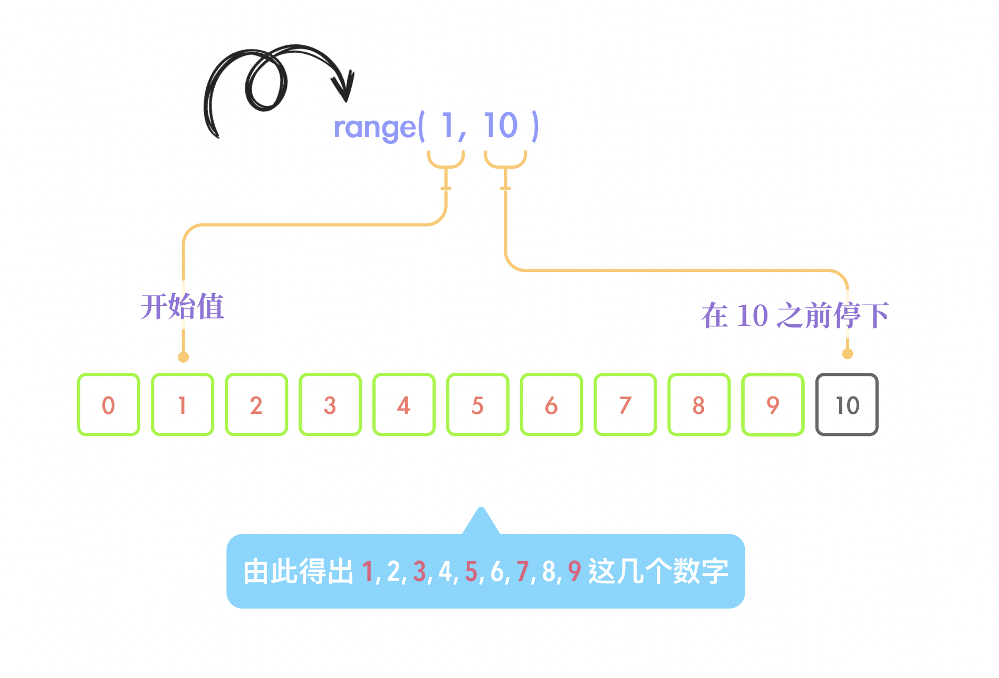

### 31 - 7 - 2020 題目

> 表达式 len(range(1,10)) 的值是什么？
>
> A. 1
>
> B. 10
>
> C. 9
>
> D. 11


答案：**C. 9**

## 解析思路

這題目我們能看到有兩個函數，分別是 len 和 range 函數。而運算的先後次序就像是數學題一樣，應從裏邊算起，即 range(1, 10)。

### Ranges 的原理

參考 Python 官方文檔的 [Ranges](https://docs.python.org/3/library/stdtypes.html?highlight=range#ranges) 章節，我們能找到以下有用的說明。

> The `range` type represents an immutable sequence of numbers and is commonly used for looping a specific number of times in `for` loops.
>
> *class* `range`(*stop*)
> *class* `range`(*start*, *stop*[, *step*])
> The arguments to the range constructor must be integers (either built-in `int` or any object that implements the `__index__` special method). If the *step* argument is omitted, it defaults to `1`. If the *start* argument is omitted, it defaults to `0`. If *step* is zero, `ValueError` is raised.

從以上文字裏，我們知道 Range 函數是一個構造器（constructor），在當我們把它變成 iterator 時，它才會真正地產生一個數字序列。注意我這裏說的數字序列並不是以列表、元組或一切其他的序列形式表達，它就只是單純的一組數字而己。在當我們還沒把它變成 iterator 前，它就只是一個單純的構造器而已。這裏說得或者有點抽象，以下我做一下演示。

```python
x = range(10)  #第一組
print(x)

sequence = list(x)  #第二組
print(sequence)

for y in x:   #第三組
  print(y,sep=",")
```

輸出結果：

```python
range(0, 10)
[0, 1, 2, 3, 4, 5, 6, 7, 8, 9]
0
1
2
3
4
5
6
7
8
9
```

這裏抽點空間解釋一下上面的原理。

先看第一組，range (10) 只是一個單純的構造器，當中沒有做任何變成 iterator 的過程，所以 print 它時，它還是原來的樣子，即 range(0, 10)，這裏 range (0, 10) 只是 range (10) 的完整樣子，詳情可以參考 Python 官方文檔的 [Ranges](https://docs.python.org/3/library/stdtypes.html?highlight=range#ranges) 章節。

接著看第二組，list 函數把 range 構造器對象改成了 iterator，然後靠這個 iterator 生成了一組數字，然後再把這組數字放進了列表容器裏，所以最後 print 出來的就是一個完整的列表。

> 這裏再詳細一點地解說 list 怎樣把 range 構造器對象變成列表對象。List 函數會呼叫 range 構造器對象裹的 \_\_iter\_\_( ) 方法（method），使其變成一個 iterator，然後不斷再呼叫這個 iterator 裏的 \_\_next\_\_( ) 方法（method），把裏頭的一個個數字回傳給 list 函數，直至傳回所有數字，然後 iterator 會提出一個 StopIteration 的异常（exception），讓 list 函數知道該收手了，list 函數就會收到一組概念上類似 0,1,2,3,4,5,6,7,8,9 的數字序列。最後 list 函數就會把這組數字序列變成列表（list）對象。
>
> 另外關於如何知道 range 構造器對象和 iterator 裏有甚麼方法（method），你可以使用 dir 函數查看，詳情可以去 [Built-in Functions](https://docs.python.org/3/library/functions.html?highlight=dir#dir) 章節查看。

最後看第三組，for 循環也是像 list 函數一樣的方式，先把 range 構造器對象變成了 iterator，然後不斷呼叫這個 iterator 的 \_\_next\_\_( ) 方法（method），得出了一堆數字，等到 iterator 提出了 StopIteration 的异常（exception），for 循環才收手。

### range(1,10)

好了，說完了 range 的原理後，我們再看回題目吧。這個 range 對象實際上是不會自動產一組數字的，但概念上來說是會產生出一組數字的。

依照文章最頭部分對 Ranges 章節的引用，我們知道頭兩個參數分別是 start 和 stop，分別的意思是開始值和在哪個數字前該停止的值。



於是便產生了以下的一組數字。

> 1, 2, 3, 4, 5, 6, 7, 8, 9

雖然這裏我們是看到得出了一組數字，但這只是概念上算出的，不是真正運算過了。真正地開始運算是題目中的 len 函數，接著下一節我會詳細說明。

### len 函數

好了，接著我們再看 len 函數，根據 Python 官方文檔的 [Built-in Functions](https://docs.python.org/3/library/functions.html?highlight=len#len)，我們能找到以下有用的說明。

> `len`(*s*)
>
> Return the length (the number of items) of an object. The argument may be a sequence (such as a string, bytes, tuple, list, or range) or a collection (such as a dictionary, set, or frozen set).

以上的意思是找序列或集合中含有的元素數量。

len 函數在開始作用時，會呼叫 range 構造器對象中的 \_\_len\_\_() 方法（method），然後就會運算出 1, 2, 3, 4, 5, 6, 7, 8, 9 這組數字，最後才數數有多少個數字，數完了再返回總共的數量。

那麼明顯能看到上面 range 構造器對象生成了 9 個數字。因此最後答案便是 9 。

