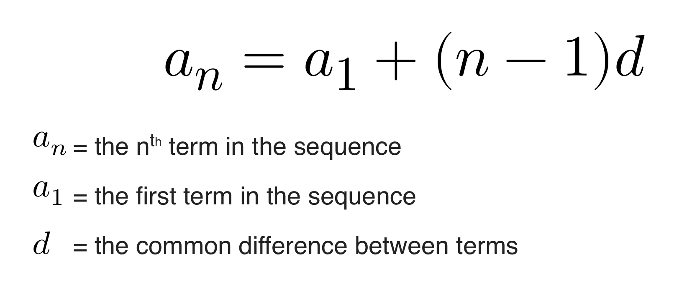

### 4 - 8 - 2020 題目

> 已知 x = list( range(20) )，那么语句 print ( x [100:200] ) 无法正常执行。
>
> 这种说法正确吗？
>
> A: 正确
>
> B: 错误

答案：**B.錯誤**

## 解析過程

本文章所提及的官方文檔及參考小節，如無特別另外指明，一率默認為 [Python 官方文檔](https://docs.python.org/3/)。

---

由於複雜性，這裏我使用兩個版本作答。一個為簡單版，另一個為詳細版。

### 簡單版

range(20) 這個構造器（constructor）會產生一組 0 至 19 的數字。

> 0, 1, 2, 3, 4, 5, 6, 7, 8, 9, 10, 11, 12, 13, 14, 15, 16, 17, 18, 19

list 函數則會將這組數字變成一個列表（list）對象。

> [ 0, 1, 2, 3, 4, 5, 6, 7, 8, 9, 10, 11, 12, 13, 14, 15, 16, 17, 18, 19 ]

然後將這個列表對象賦值給 x。

題目中的 x [ 100 : 200 ] 為切片（Slicings）表达式（Expression），意思是抽取 x 列表中第 100 個的索引值至第 200 個的索引值。

但由於 x 列表最多只有 20 （n）個數字，即最多有 n - 1 個索引值，所以沒辦法抽取超過第 19 個索引的值。

正常人一般直覺是會報錯，但由於 Python 的特別設計的原因，所以不會報錯，反而是返回一個空的列表對象。如果想知道為甚麼不會報錯，可以看下一章節詳細版的「第二行程序碼」小節。

最後，print 函數是打印對象到屏幕的意思（注釋 1），所以最後看到的就是 [ ]。

這整個過程也沒有任何報錯，所以可以正常執行。


### 詳細版

先轉化一下題目的表達形式，使題目更容易理解。

```python
x = list( range(20) )
print ( x[ 100:200 ] )
```

#### 第一行程序碼

我們先看第一行，= 號是賦值的意思，= 號的左邊是賦值目標（x），右邊是表达式（expression），我們應該從右邊看起，因為  [Assignment statements](https://docs.python.org/3/reference/simple_stmts.html?highlight=assignment#assignment-statements) 章節是這樣寫的。

> Assignment statements are used to (re)bind names to values and to modify attributes or items of mutable objects:
>
> ```
> assignment_stmt ::= (target_list "=") + (starred_expression | yield_expression)
> …
> ```
> 
>An assignment statement evaluates the expression list (remember that this can be a single expression or a comma-separated list, the latter yielding a tuple) and assigns the single resulting object to each of the target lists, from left to right. …

上面最後一段寫了該先計算了表達式（expression），然後再賦值給賦值目標。

然後到了看 list( range(20) )，range 函數是一個構造器（constructor），可以產生一個等差數列（[Arithmetic progression](https://en.wikipedia.org/wiki/Arithmetic_progression) ），根據 [Ranges](https://docs.python.org/3/library/stdtypes.html?highlight=range#range) 章節。

> *class* `range`(*stop*)
>
> *class* `range`(*start*, *stop*[, *step*])
>
> … The arguments to the range constructor must be integers (either built-in `int` or any object that implements the `__index__` special method). If the *step* argument is omitted, it defaults to `1`. If the *start* argument is omitted, it defaults to `0`. If *step* is zero, `ValueError` is raised.
>
> For a positive *step*, the contents of a range `r` are determined by the formula `r[i] = start + step*i`where `i >= 0` and `r[i] < stop`. …

上面說到 range 函數的完整寫法是 `range`(*start*, *stop*[, *step*])，意思是：

> range ( 開始值 , 在這個數字前停止 , 上一個數字增加多少便產生下一個數字 )

如果把 start 和 step 參數省略了，就是 range (stop) ，而這便是題目中的 range (20) 的樣子。

range 函數是一個構造器，並不會自動產生數列，它是需要靠 list 函數對象呼叫 range 函數對象裏的 \_\_iter\_\_()  方法（method），range 函數對象才開始產生數列的，詳細運作請看[這篇文章裏的 「Ranges 的原理」小節](./200731.md#ranges-的原理)。

range (20) 是指產生從 0 開始的數字至到 20 這個數字前就停止。

> 0, 1, 2, 3, 4, 5, 6, 7, 8, 9, 10, 11, 12, 13, 14, 15, 16, 17, 18, 19

這組數字會接著回傳給 list 函數對象，而 list 函數的作用根據 [Lists 章節](https://docs.python.org/3/library/stdtypes.html#list)：

> *class* `list`([*iterable*])
>
> The constructor builds a list whose items are the same and in the same order as *iterable*’s items. *iterable* may be either a sequence, a container that supports iteration, or an iterator object. If *iterable* is already a list, a copy is made and returned, similar to `iterable[:]`. For example, `list('abc')` returns `['a', 'b', 'c']` and `list( (1, 2, 3) )` returns `[1, 2, 3]`. If no argument is given, the constructor creates a new empty list, `[]`. …

按照上面的意思，list 函數與 range 函數一樣，也是一個帶有 \_\_iter\_\_()  方法（method）的構造器（constructor）。用作把序列對象、支援 iteration 的容器（container）對象和 iterator 對象變成列表（list）。（注釋 3）

於是便產生以下的列表：

> [ 0, 1, 2, 3, 4, 5, 6, 7, 8, 9, 10, 11, 12, 13, 14, 15, 16, 17, 18, 19 ]

最後，這個列表便賦值給了 x 變數對象。

#### 第二行程序碼

第二行程序碼是：

```python
print ( x[ 100:200 ] )
```

print 函數是最基礎常見的函數，用作把對象（通常是你想輸出的信息）打印到屏幕上。（注釋 1）

但它裏頭還有沒完成計算的表達式（expression ），即 x [ 100: 200]，所以我們得先計算它。

x [ num : num] 這樣形式的語法名字叫作「切片」（Slicing），根據 Expressions 章節底下的 [Slicings 小節](https://docs.python.org/3/reference/expressions.html#slicings)：

> A slicing selects a range of items in a sequence object (e.g., a string, tuple or list). Slicings may be used as expressions or as targets in assignment or `del` statements.  …
>
> ```
> slicing      ::=  primary "[" slice_list "]"
> slice_list   ::=  slice_item ("," slice_item)* [","]
> slice_item   ::=  expression | proper_slice
> proper_slice ::=  [lower_bound] ":" [upper_bound] [ ":" [stride] ]
> …
> ```
>
> … The semantics for a slicing are as follows. The primary is indexed (using the same `__getitem__()` method as normal subscription) with a key that is constructed from the slice list, as follows. …

根據上面所說，「切片」（Slicing）的作用是抽取序列對象裏一個範圍裏的元素。

但實際上「切片」又是如何運作的呢？根據 [Glossary 章節](https://docs.python.org/3/glossary.html)底下的 slice 小節。

> An object usually containing a portion of a sequence. A slice is created using the subscript notation, [] with colons between numbers when several are given, such as in variable_name[1:3:5]. The bracket (subscript) notation uses slice objects internally.

上面說到「切片」中的數字是使用到了 slice 函數對象代為處理的。所以我們又找到 Built-in Functions 章節底下的 [slice 小節](https://docs.python.org/3/library/functions.html#slice)。

> *class* `slice`(*stop*)
>
> *class* `slice`(*start*, *stop*[, *step*])
>
> Return a [slice](https://docs.python.org/3/glossary.html#term-slice) object representing the set of indices specified by `range(start, stop, step)`. The *start* and *step* arguments default to `None`. Slice objects have read-only data attributes `start`, `stop`and `step` which merely return the argument values (or their default). They have no other explicit functionality; however they are used by Numerical Python and other third party extensions. Slice objects are also generated when extended indexing syntax is used. For example: `a[start:stop:step]` or `a[start:stop, i]`. See [`itertools.islice()`](https://docs.python.org/3/library/itertools.html#itertools.islice) for an alternate version that returns an iterator.

根據上面所說，slice 函數會返回一個儲存著一堆索引值的 slice 對象。這個索引值可以用於之後抽取序列對象裏一個範圍內的元素。巧的是，slice 函數當中的數字處理是籍由 range 函數代為處理的。

上面 x 變數對象儲存的是指向 0 至 19 的列表對象的引用值（reference），可以簡單地理解為 x 變數就是儲存了 0 至 19 的列表對象（雖然嚴格上不是）（注釋 4）。

> [ 0, 1, 2, 3, 4, 5, 6, 7, 8, 9, 10, 11, 12, 13, 14, 15, 16, 17, 18, 19 ]

以上的列表包含位置索引（index）0 至索引 20。索引 0 代表列表的第一個元素，以此類推。

題目裏寫的是 x[ 100:200 ]，對應上面文檔的說明，100 和 200 分別對應 start 和 stop 參數。也就是 range 函數中「開始值」和「在這個數字前停止」，更直白地說，就是抽取 x 列表對象中的位置索引 100 至 200 的值。

可是問題來了，x 列表對象只有 20 個元素呀，哪來可以抽取可取位置索引以外的元素呢？一般我們直覺來講，應該會報錯才對。例如以下的程序碼示範，單個位置索引的元素抽取，如果不在抽取範圍內，是會報錯的。

```python
x = [1, 2, 3]
print( x[3] )
```

輸出結果：

```
Traceback (most recent call last):                                                                                       		File "tmp1.py", line 2, in <module>
			print( x[3] )
IndexError: list index out of range
```

可是 Python 語言對於這種情況有特別地設計，導致最後反而不報錯。為甚麼呢？

我們就抱著這好奇的想法，再看看 Expressions 章節底下的 [Slicings 小節](https://docs.python.org/3/reference/expressions.html#slicings)：

> …
> ```
> slicing      ::=  primary "[" slice_list "]"
> slice_list   ::=  slice_item ("," slice_item)* [","]
> slice_item   ::=  expression | proper_slice
> proper_slice ::=  [lower_bound] ":" [upper_bound] [ ":" [stride] ]
> …
> ```
>
> … The semantics for a slicing are as follows. The primary is indexed (using the same \_\_getitem\_\_() method as normal subscription) with a key that is constructed from the slice list, as follows. …

上面說到當要開始在一個對象（代表上面的 x 列表對象）裏開始抽取元素時，實際是像 subscription 語法形式的方法（注釋 5）一樣，呼叫那個對象裏的 \_\_getitem\_\_() 方法（method），才能抽取出數字的。

於是我們就再參考 Emulating container types 底下的 [ \_\_getitem\_\_()](https://docs.python.org/3/reference/datamodel.html?highlight=emulating%20container%20types#object.__getitem__) 章節：

> `object.__getitem__`(*self*, *key*)
>
> Called to implement evaluation of `self[key]`. For sequence types, the accepted keys should be integers and slice objects. Note that the special interpretation of negative indexes (if the class wishes to emulate a sequence type) is up to the `__getitem__()` method. If *key* is of an inappropriate type, `TypeError`may be raised; if of a value outside the set of indexes for the sequence (after any special interpretation of negative values), `IndexError` should be raised. For mapping types, if *key* is missing (not in the container), `KeyError` should be raised. …

上面說到如果抽取一個不在範圍內的值，是會報 IndexError 的異常（exception）錯誤信息。

接著我們就再查看 Concrete Exceptions 章節底下的 [IndexError 小節](https://docs.python.org/3/library/exceptions.html?highlight=indexerror#IndexError)。

> *exception* `IndexError`
>
> Raised when a sequence subscript is out of range. (Slice indices are silently truncated to fall in the allowed range; if an index is not an integer, [`TypeError`](dfile:///Users/Cam/Library/Application Support/Dash/DocSets/Python_3/Python 3.docset/Contents/Resources/Documents/doc/library/exceptions.html#TypeError) is raised.)

噢！真相大白了，原來當利用 Slice 對象去抽取的範圍是在可抽取的範圍以外，系統就會自動偷偷地把 slice 對象抽取的範圍弄到可抽取的範圍內，所以才不報錯。

在執行完題目的程序碼後，正常會得出以下的結果。

> [ ]

對，就是一個空的列表。原因大概就是因為 slice 對象抽取的範圍反正沒有東西，所以就被趕到了類似 range(0, 0) 的位置了，於是根本就無法從 x 列表對象裏抽取出任何元素。

所以最後才得出一個空的列表。

---

注釋 1：更正確的說法是 print 函數把對象（object）打印到了  *file*  指定的文本流（text stream  *file*），而不是屏幕，詳情請看 Built-in Functions 章節底下的 [print 函數小節](https://docs.python.org/3/library/functions.html#print)。

注釋 2： 等差數列（Arithmetic progression）a(n th), a(n th), a(n th), … 是用以下公式算出來的。

注釋 3：關於 list 函數、range函數 、序列、支援 iteration 的容器（container）和 iterator 等等之間的關係圖，你可以看[這篇文章的「Ranges 的原理」小節](./200731.md#ranges-的原理)裏的圖示。

注釋 4：為了讓我們更好地認識「面向对象程序设计 」（Object-oriented programming）裏的對象（object）的概念，我們借用 Javascript 的 [Object 章節](https://javascript.info/object)和 [Object copying, references 章節](https://javascript.info/object-copy)裏的解說，裏邊有詳細的圖文講解。

注釋 5：subscription 語法形式的方法其實跟「切片」（slicing）極像，唯一的不同是，subscription 只能抽取一個元素，而 slicing 則可以抽取多個元素。詳細請參考 Expressions 底下的 [Subscriptions 章節](https://docs.python.org/3/reference/expressions.html?highlight=subscriptions#subscriptions)。